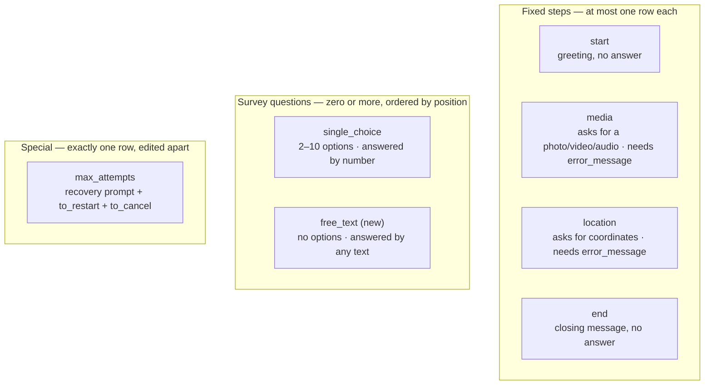

# Feature spec — Bot setup: configuring a map's bot conversation

## Purpose

Let a map owner configure, per map, the messages and survey questions the
bot uses while onboarding a new mapper — and, this iteration, add a second
kind of survey question whose answer is **free text**, alongside the
existing **single choice** kind.

The runtime that consumes this configuration —
`FirstTimeMappingFlow` and the conversation engine — is specified in
[first_time_mapping_flow.md](first_time_mapping_flow.md) and
[conversation_engine.md](conversation_engine.md). This doc is about the
**configuration**: its model, its storage, the endpoints that read and
write it, the rules that govern what may be written, and the setup UI. It
was written to document an area of the codebase that had no spec, so most
of it describes existing behavior as-is; the parts that are new in this
iteration are marked **(new)**.

## Scope

**In scope**

- The configuration model: `maps.bot_active` plus the
  `bot_configured_messages` table, and the `BotStep` kinds it holds (fixed
  steps, survey questions, the max-attempts row).
- The `GET`/`PUT /map/{map_id}/bot/` endpoints, owner-only, and the
  `BotSetup` validation that decides what may be saved and when the bot may
  be enabled.
- The two survey question kinds and how the flow tells them apart when an
  answer arrives: **single choice** (baseline) and **free text** (new).
- The `bot_step` Postgres enum change (new value), folded into the
  unreleased migration that creates the type.
- The `chatmap-ui` bot setup page: adding a question of either kind,
  editing it, validating the form before save.

**Out of scope / deferred**

- The flow's runtime mechanics — state machine, event detection, message
  sending, fallback/recovery. See
  [first_time_mapping_flow.md](first_time_mapping_flow.md).
- Rich answer validation for free text (required/optional, min/max length,
  pattern). Explicitly **not** built — see [Decisions](#decisions) #2.
- Reordering existing questions in the UI. The list is append-only today;
  `position` follows insertion order. See [Open questions](#open-questions).
- Analytics on survey answers, and any export beyond what the map popup
  already shows.
- Encrypting survey answers at rest. Not changed — see
  [Decisions](#decisions) #8.
- `MAX_ATTEMPTS` content rules beyond what already exists.

## The configuration model

A map's bot configuration is two things:

- **`maps.bot_active`** (boolean) — whether the bot runs for this map's
  linked device at all.
- **`bot_configured_messages`** — one row per message the owner configured,
  all for the same `map_id`.

### The `bot_configured_messages` row

| Column                  | Meaning                                                                                                  |
|-------------------------|--------------------------------------------------------------------------------------------------------|
| `id`                    | UUID string, generated on insert. **Preserved across edits** so the survey answer cursor keeps matching. |
| `map_id`                | FK to `maps.id`.                                                                                        |
| `bot_step`              | Postgres enum `bot_step` — which kind of message this is (see below).                                   |
| `position`              | Integer, ordering **among survey questions only**; `NULL` for every other kind.                          |
| `content`               | The message text — the greeting, the prompt, the question. Exposed on the domain object as `prompt`.     |
| `error_message`         | What the bot replies when the answer is not acceptable. `NULL` for steps that expect no answer.          |
| `options`               | JSONB list of strings. Non-empty only for `single_choice`.                                              |
| `max_attempts_quantity` | Integer. Set only on the `max_attempts` row; `NULL` otherwise.                                          |
| `to_restart`            | Option label that restarts the flow. `max_attempts` row only.                                            |
| `to_cancel`             | Option label that cancels the flow. `max_attempts` row only.                                             |

### The `bot_step` kinds

| Kind            | Cardinality              | Uses `content` | Uses `error_message`     | Uses `options` | Uses `position` |
|-----------------|--------------------------|----------------|--------------------------|----------------|-----------------|
| `start`         | 0 or 1                   | yes            | no                       | no             | no              |
| `media`         | 0 or 1                   | yes            | yes                      | no             | no              |
| `location`      | 0 or 1                   | yes            | yes                      | no             | no              |
| `end`           | 0 or 1                   | yes            | no                       | no             | no              |
| `single_choice` | 0 or more                | yes            | yes                      | **2–10**       | yes             |
| `free_text`     | 0 or more **(new)**      | yes            | yes                      | **empty**      | yes             |
| `max_attempts`  | exactly 1 (auto-managed) | yes            | no (`to_*` instead)      | no             | no              |

A **survey question** is a row whose `bot_step` is `single_choice` or
`free_text`. The survey the mapper answers is every such row for the map's
owner, in `position` order, single choice and free text interleaved
however the owner arranged them.

## Endpoints and validation

Both endpoints are under `/map/{map_id}/bot/` and require the caller to be
the map's owner; anyone else gets `401`, as does a missing map.

### `GET /map/{map_id}/bot/`

Returns a `BotSetupResult`: `bot_active`, the list of configured
`messages` (every kind **except** `max_attempts`), and
`max_attempts_messages` as its own object (assembled from the
`max_attempts` row, or defaults if there is none). An unconfigured map
reads back `bot_active=false` and an empty list.

### `PUT /map/{map_id}/bot/`

Body is a `BotSetup`: `bot_active`, `messages`, `max_attempts_messages`.
On success it replaces the map's configuration and returns the same shape
as `GET`.

- The `max_attempts_messages` object is folded back into the `messages`
  list as a synthetic `max_attempts` row before persistence — the owner
  edits it through a dedicated field because the bot needs to know which
  option cancels and which restarts, not a free list.
- Persistence (`update_configured_messages`) is **upsert by `id`, then
  delete the rest**: a row whose `id` matches an existing one is updated in
  place; a row with no `id` (or an unknown one) is inserted; any existing
  row not present in the payload is deleted. This is why the client must
  round-trip `id`s — a question that loses its `id` becomes a new row, and
  survey answers already recorded against the old `id` (which is how
  [first_time_mapping_flow.md](first_time_mapping_flow.md) matches the
  cursor) would no longer line up.

### `BotSetup` validation rules

Enforced by `BotSetup.check_messages`. Two tiers:

**Always enforced — even while the bot is off.** A half-written question is
not something the bot could ever ask, so it is rejected regardless of
`bot_active`:

| Rule                                                                    | Applies to                    |
|------------------------------------------------------------------------|-------------------------------|
| A fixed step (`start`/`media`/`location`/`end`) may appear only once   | fixed steps                   |
| `max_attempts` may not be sent as a member of `messages`               | all                           |
| Question text (`prompt`) is filled                                     | `single_choice`, `free_text`  |
| Incorrect-answer text (`error_message`) is filled                      | `single_choice`, `free_text`  |
| Between `MIN_OPTIONS` (2) and `MAX_OPTIONS` (10) non-empty options     | `single_choice`               |
| No options **(new)**                                                   | `free_text`                   |

**Enforced only when `bot_active` is true:**

| Rule                                                                        |
|---------------------------------------------------------------------------|
| `start`, `media`, `location`, `end` are all present with non-empty text  |
| `media` and `location` each have a non-empty `error_message`             |
| `max_attempts_messages` has `notify_message`, `to_restart`, `to_cancel`  |
| `max_attempts_quantity >= 1`                                             |

A configuration that violates a "when active" rule can still be saved with
`bot_active=false`.

## Survey question kinds

Both kinds are stored as rows, ordered together by `position`, and both
produce a `SurveyResponse` entry
(`{question_id, question, answer}`) shown on the map popup as a
`question` / `answer` pair. They differ only in what the mapper is
expected to send and how the flow interprets it.

| Aspect                        | `single_choice`                                          | `free_text` **(new)**                                        |
|-------------------------------|---------------------------------------------------------|-----------------------------------------------------------|
| `options`                     | 2–10 labels                                             | none                                                     |
| How the bot renders it        | prompt + numbered option list (keycap emoji 1️⃣–🔟)      | prompt only                                              |
| What the mapper sends         | the number of an option                                | any text                                                |
| How the answer is resolved    | `selected_option` maps the number to its label          | the text is taken verbatim                               |
| Invalid answer (as text)      | not a digit / out of range → re-ask with `error_message`| **there is no invalid answer** — any text is accepted    |
| `error_message` is shown when | the number is invalid, **or** the reply is the wrong type (photo/audio/location) | **only** when the reply is the wrong type |
| Stored answer                 | the option label                                        | the text as sent (after decryption), unmodified          |

### How the flow tells them apart

Covered in full by
[first_time_mapping_flow.md](first_time_mapping_flow.md); the points that
matter for this feature:

- The state is unchanged: `WAITING_SURVEY_ANSWER`, entered after
  coordinates when the survey is non-empty, with the single transition
  `(WAITING_SURVEY_ANSWER, USER_SEND_TEXT) → on_survey_answered`. Free text
  reuses it — the question kind is a property of the pending question, not
  a distinct conversation state. **(new)**
- `on_survey_answered` branches on the pending question's `bot_step`: for
  `single_choice` it runs `selected_option` as today; for `free_text` it
  skips that entirely and records `ctx.answer` as-is, then advances the
  cursor. **(new)**
- `on_fallback` needs **no change**. Its `WAITING_SURVEY_ANSWER` branch
  already sends `[question.error_message, <the question>]` when the reply
  is the wrong type — for a free-text question `error_message` is filled
  (required) and the question renders without options.
- `build_options_message(prompt, options)` gets a guard: with no options
  it returns just `prompt`. This one change covers every place a question
  is rendered — the first ask, the next-question ask, and the wrong-type
  re-ask. **(new)**
- `BotConfiguredMessages.survey_questions()` widens from "`bot_step ==
  SINGLE_CHOICE`" to "`bot_step in (SINGLE_CHOICE, FREE_TEXT)`". The
  cursor helpers (`next_question_to_answer`, `has_survey_questions`) follow
  for free. **(new)**
- The answer message is marked consumed (kept off the map) before it is
  recorded, exactly as for single choice — a text reply while
  `WAITING_SURVEY_ANSWER` is an answer, not a map note.

## The bot setup UI

`chatmap-ui`, page `pages/botSetup`, helpers in `utils/botSetup.js`.

- The page lists the fixed steps, then the survey questions, then an "add"
  affordance, then the end step, then the max-attempts section behind a
  button.
- **Adding a question: two buttons — "single choice" and "free text".**
  **(new)** Each appends an empty question of that kind
  (`emptyQuestion(kind, position)`), a single-choice one seeded with two
  blank options, a free-text one with none.
- **A question's kind is fixed once created.** To change kind, remove it
  and add the other. Keeps the editor and the validator from having to
  reconcile a kind switch against options and recorded answers. **(new)**
- `EditBotItemDialog` is already "one shell for every kind of message" —
  it shows the option editor only when `bot_step === "single_choice"` and
  not editing the error text. A free-text question therefore falls through
  to the plain prompt / error-message editor with no change beyond a
  kind-appropriate placeholder. **(new, minimal)**
- `problemsIn` marks a survey question as blocking save when its `prompt`
  or `error_message` is empty; the 2–10 options check applies to
  single-choice questions only. **(new: the per-kind split)**
- `messagesToSave` assigns `position` to every survey question
  (single choice and free text) in list order, `NULL` to everything else.
- New i18n message ids for the free-text label and its add button.

## Behavior

| Situation                                                        | Trigger                                                                                        | Observable result                                                                                                                                 |
|-----------------------------------------------------------------|----------------------------------------------------------------------------------------------|-----------------------------------------------------------------------------------------------------------------------------------------------------|
| Owner adds a free-text question and saves                       | `PUT` with a `free_text` message, `prompt` + `error_message` filled, no options               | Row persisted with `bot_step='free_text'`, `options=[]`, `position` in survey order. Accepted whether or not `bot_active`.                          |
| Owner adds a free-text question with options                    | `PUT` with a `free_text` message carrying a non-empty `options` list                          | `422` — "a free text question takes no options". **(new rule)**                                                                                    |
| Owner adds a free-text question with no `error_message`          | `PUT` with a `free_text` message, `error_message` blank                                       | `422` — same rule as single choice: a survey question needs its incorrect-answer message.                                                          |
| Mapper answers a free-text question with text                   | `WAITING_SURVEY_ANSWER`, pending question is `free_text`, `USER_SEND_TEXT`                     | The decrypted text is stored verbatim as the answer; cursor advances; next question asked, or `end` sent and the flow completes. Message kept off the map. |
| Mapper answers with a number for a free-text question           | same, mapper sends `"3"`                                                                       | `"3"` is stored as the answer — free text does not interpret numbers. Cursor advances.                                                             |
| Mapper sends only whitespace                                    | same, text is `"   "`                                                                          | Stored as `"   "`. No validation strips or rejects it — accepted edge, deliberately not handled (see [Decisions](#decisions) #2).                  |
| Mapper sends a photo/audio/location for a free-text question    | `WAITING_SURVEY_ANSWER`, pending question is `free_text`, event is not `USER_SEND_TEXT`        | No transition → `on_fallback`: sends `error_message` then the question (prompt only). `fallback_count` increments; enough of them → cancel/restart prompt, per [first_time_mapping_flow.md](first_time_mapping_flow.md). |
| Mapper sends a photo **with a caption** for a free-text question | `Event.from_message` matches the photo before the text → `USER_UPLOAD_PHOTO`                   | The caption is ignored; handled exactly like a photo with no caption (row above) — no transition → `on_fallback` sends `error_message` then the question, `fallback_count` increments. |
| Owner edits a question's text, keeps its `id`                   | `PUT` with the same `id`                                                                       | Row updated in place; answers already recorded against that `id` still line up with the cursor.                                                    |
| Owner removes a question mid-survey for some mapper             | `PUT` without that `id`; a mapper is currently `WAITING_SURVEY_ANSWER` on it                   | Row deleted. That mapper's next text: cursor finds no pending question → `BotStateWithoutQuestion` is raised for that message (per the flow spec). |
| Owner turns the bot on with a half-written question             | `PUT` `bot_active=true`, some survey question missing `prompt`/`error_message`/options         | `422` — the always-enforced tier fails before the "when active" tier is even checked.                                                              |
| Owner turns the bot off with a half-written question            | `PUT` `bot_active=false`, same                                                                 | Still `422` — a half-written question is rejected in both tiers.                                                                                   |
| Migration runs on a fresh database                              | `alembic upgrade`                                                                              | The `bot_step` type is created with `'free_text'` already among its values — the value is part of the type's creating migration (`c41d7f9a2e08`), not a later one. |
| A database already at `c41d7f9a2e08` gets the branch update     | `git pull` + `alembic upgrade` (no-op)                                                        | The edited creating migration is **not** re-run; `bot_step` still lacks `'free_text'`. Fixed with a one-off `ALTER TYPE bot_step ADD VALUE IF NOT EXISTS 'free_text'`. |

## Contract

**`GET /map/{map_id}/bot/` → `BotSetupResult`**

- `bot_active: bool`
- `messages: [BotConfiguredMessage]` — `id`, `bot_step`, `position`,
  `prompt`, `error_message`, `options`; every kind except `max_attempts`.
- `max_attempts_messages: BotMaxAttemptsMessages` — `id`,
  `max_attempts_quantity`, `notify_message`, `to_restart`, `to_cancel`.

**`PUT /map/{map_id}/bot/`**

- Body: `BotSetup` = `BotSetupResult` shape + the `check_messages`
  validator. `422` on any rule above; `401` for non-owner or missing map.
- Effect: `maps.bot_active` set; `bot_configured_messages` for the map
  reconciled by `id` (upsert present, delete absent); `max_attempts`
  row derived from `max_attempts_messages`.
- Response: the new `BotSetupResult`.

**Domain objects consumed by the flow** (unchanged shape, widened
semantics):

- `BotConfiguredMessages.survey_questions()` — rows with `bot_step in
  (SINGLE_CHOICE, FREE_TEXT)`, in `position` order.
- `BotMessage` — `id`, `bot_step`, `prompt`, `error_message`, `options`
  (`[]` for free text).
- `BotConfiguredMessages.build_options_message(prompt, options)` — returns
  `prompt` alone when `options` is empty, otherwise `prompt` + the
  numbered list.

**Storage**

- `'free_text'` is added to the `bot_step` enum by editing the migration
  that creates the type (`c41d7f9a2e08`), which has not shipped past this
  branch — no separate `ALTER TYPE ... ADD VALUE` migration. See
  [Decisions](#decisions) #5.
- A `free_text` row: `options = '[]'::jsonb`, `position` non-null,
  `max_attempts_*` null.
- The answer lands in `survey_responses.answers` as
  `{question_id, question, answer}` — `answer` is the mapper's text,
  decrypted, unmodified. Stored in clear, like `points.message`.

## Decisions

1. **Free text reuses `WAITING_SURVEY_ANSWER` and its existing
   transition.** The question kind is read from the pending question row
   when an answer arrives; it is not a distinct conversation state.
   *Discarded:* a dedicated `WAITING_FREE_TEXT_ANSWER` state and handler —
   it would force `on_coordinates_sent` and the tail of
   `on_survey_answered` to pick the next state by the next question's kind,
   for no gain, since the trigger (`USER_SEND_TEXT` while in the survey) is
   identical.
2. **A free-text answer is not validated.** Any `USER_SEND_TEXT` while a
   free-text question is pending is recorded verbatim and advances the
   cursor. No trimming, no min length, no required/optional toggle. A
   whitespace-only message is stored as-is. *Discarded:* a `.strip()`
   emptiness guard that re-asks — it is a form of validation, contradicts
   "no validation", and the case is only reachable by a mapper
   deliberately sending blanks. *Discarded:* owner-configurable length or
   pattern rules — out of scope; revisit if a real need appears.
3. **A free-text question still requires `error_message`.** It is never
   shown on the happy path, but it *is* shown when the mapper replies with
   the wrong message type (photo/audio/location) and the flow falls into
   `on_fallback`. Keeping it required also keeps the validator symmetric
   with single choice. *Discarded:* making it optional for free text —
   leaves that fallback re-ask with only the bare prompt and adds an
   asymmetry between the two question kinds in `check_messages`.
4. **`build_options_message` renders the prompt alone when there are no
   options.** One guard, and it covers the first ask, the next-question
   ask, and the wrong-type re-ask — so `on_fallback` needs no change.
   *Discarded:* branching on question kind at each call site in the flow,
   or a separate render method — more code in more places for the same
   output.
5. **The new enum value goes into the migration that creates the type, not
   a new migration.** `c41d7f9a2e08` (the `bot_configured_messages` table +
   `bot_step` type) exists only on this branch and has not shipped, so its
   `postgresql.ENUM(...)` value list is edited to include `'free_text'`
   directly — a fresh `alembic upgrade` then creates the type with all
   seven values. **Caveat:** a database that already ran `c41d7f9a2e08`
   (local dev on this branch) will not pick the edit up — Alembic never
   re-runs an applied revision. Those need a one-off
   `ALTER TYPE bot_step ADD VALUE IF NOT EXISTS 'free_text'` (or a
   downgrade/upgrade of `c41d7f9a2e08`, which drops the table). *Discarded:*
   a follow-up migration doing that `ALTER TYPE` in an
   `op.get_context().autocommit_block()` (needed because `ADD VALUE` cannot
   run in Alembic's default transaction) — the right tool once
   `c41d7f9a2e08` has shipped, but ceremony for a branch-only migration
   that is still editable. The value lands last in enum sort order on an
   already-migrated DB vs. after `single_choice` on a fresh one; nothing
   orders by `bot_step`, so this is cosmetic.
6. **A question's kind is fixed at creation in the UI.** Changing kind
   means remove and re-add. *Discarded:* an in-place kind switcher — it
   would have to reconcile options appearing/disappearing and any answers
   already recorded against that `id`.
7. **Two "add question" buttons, one per kind.** *Discarded:* one button
   plus a type selector (menu/dropdown) — an extra component and
   interaction; the page already uses full-width row buttons for adding.
8. **Free-text answers are stored in clear in `survey_responses`.** This
   matches how `points.message` is already handled: the Live pipeline
   decrypts stream content and persists it in clear in Postgres
   ([live_mode.md D-004](live_mode.md#d-004-encrypt-content-hash-identifiers)
   describes the encryption boundary as the Redis stream, with the API
   decrypting before it stores/serves). Single-choice answers already sit
   there in clear. *Discarded:* encrypting survey answers at rest — it
   would be a new, inconsistent boundary for one column; if answers at
   rest need protecting, that is a cross-cutting decision covering
   `points.message` too, not this feature.
9. **This doc documents the whole bot-setup area, not just free text.**
   The area had no spec; single choice, the config model, the endpoints
   and the validator are recorded here as-is so the new kind has a
   baseline to sit against. *Discarded:* a narrow `free_text` doc — it
   would have had to restate most of this as context anyway.

## Open questions

- **Questions cannot be reordered in the UI.** `position` follows
  insertion order; there is no drag/reorder control. Removing and
  re-adding is the only way to change order, which also changes the
  question's `id`.
