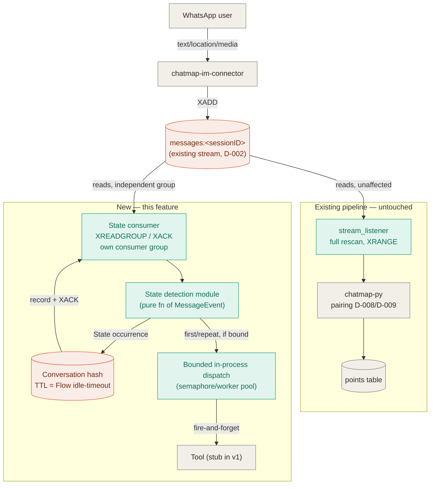

# Feature spec — Conversation engine (Flow / State / Tool)

## Purpose

Give `chatmap-api` a generic, reusable engine that turns a sequence of
incoming chat messages from the same sender/chat into a tracked
**Conversation**, deterministically recognizes **States** (facts) within it,
and fires configured **Tools** as side effects — as the foundation for a
future chatbot feature, built in parallel with the existing pipeline and
without modifying it.

## Scope

**In scope**

- The **Flow** definition model: a named, configured set of States, each with
  optional prerequisite State(s), a per-Flow idle-timeout, and per-`(Flow,
  State)` Tool bindings (`on_first` / `on_repeat`).
- A deterministic **State detection** module: pluggable rules mapping a
  `MessageEvent`'s fields to a State id (e.g. `photo` non-empty →
  `photo_received`), easy to change independently of the engine.
- **Conversation** lifecycle: creation, matching key, idle-timeout boundary,
  recording State occurrences.
- New Redis-consumer-group-based infrastructure (`RedisConsumer` base class)
  reading the existing `messages:<sessionID>` stream, coexisting with the
  existing full-rescan consumer.
- Fire-and-forget **Tool dispatch**, bounded in-process concurrency, and the
  failure-isolation guarantee that makes bounding safe.
- One concrete Flow for v1, `link_conversation`, used to exercise the engine
  end to end — its Tool bindings are stubs (log/no-op), not a real chatbot.

**Out of scope / deferred**

- The real chatbot Tool (LLM integration) — a future feature. This feature
  only has to prove the hook fires correctly.
- Outbound message delivery (a `to_send`-style stream back to
  `chatmap-im-connector`, and the connector-side changes to send it). No Tool
  built in this feature needs to deliver a message, so this isn't needed yet.
  **Escalated to the architect skill** — see [Escalation](#escalation).
- Re-implementing photo/coordinate pairing or Postgres point creation.
  [D-008](../how-it-works/live_mode.md#d-008-pairing-window-constant) and
  [D-009](../how-it-works/live_mode.md#d-009-pairing-match-criteria) are
  untouched; `chatmap-py` is not modified.
- Multi-Flow selection/arbitration — v1 ships exactly one Flow, so any
  message matching one of its State detectors (with no active Conversation
  for that sender/chat) starts a Conversation of that Flow. Choosing *which*
  Flow to start, once more than one exists, is deferred.
- Flow/Conversation completion signaling — there is no `on_complete` hook and
  no completion flag (see [Decisions](#decisions)).
- A durable tool-dispatch queue / exactly-once delivery — at-least-once is
  accepted, with documented limitations, rather than built around.

## Entity model

| Concept          | Definition                                                                                                                                                                                    |
|------------------|-----------------------------------------------------------------------------------------------------------------------------------------------------------------------------------------------|
| **Flow**         | Named config: a set of States (each with optional prerequisite States — default none, meaning any order), a per-Flow idle-timeout, and per-State `on_first`/`on_repeat` Tool bindings.        |
| **State**        | A fact that has already happened, recognized by a deterministic, pure function of a `MessageEvent` (no Conversation context).                                                                 |
| **Conversation** | A running instance of a Flow, keyed by (hashed sender, hashed chat). Records an append-only sequence of State occurrences. One active Conversation per key.                                   |
| **Tool**         | Optionally bound per `(Flow, State)`, one binding for the State's first occurrence in a Conversation and one for every occurrence after that. Fire-and-forget, non-blocking, failures logged. |

## Diagram

## Behavior

| Situation                                     | Trigger                                                                                                                   | Observable result                                                                                                                                                                                                                                                                                                                  |
|-----------------------------------------------|---------------------------------------------------------------------------------------------------------------------------|------------------------------------------------------------------------------------------------------------------------------------------------------------------------------------------------------------------------------------------------------------------------------------------------------------------------------------|
| Brand-new sender/chat                         | Message matches a State detector for the (only) Flow, no active Conversation for that key                                 | New Conversation created; State occurrence recorded; bound `on_first` Tool fires (if configured)                                                                                                                                                                                                                                   |
| Continuing conversation                       | Message matches a State not yet recorded, existing Conversation's last activity is within the Flow's idle-timeout         | Occurrence appended to the existing Conversation; `on_first` Tool fires                                                                                                                                                                                                                                                            |
| Repeated fact                                 | Message matches a State already recorded in the active Conversation                                                       | Occurrence appended (not overwritten, not discarded); `on_repeat` Tool fires if configured, otherwise no-op                                                                                                                                                                                                                        |
| Conversation gone stale                       | Message arrives for a (sender, chat) key whose Conversation's last activity exceeds the Flow's configured idle-timeout    | Treated as a brand-new Conversation in that slot; the old Conversation is not closed, flagged, or migrated — simply superseded                                                                                                                                                                                                     |
| Unrelated message                             | Message doesn't match any State detector for the configured Flow(s)                                                       | Ignored by this engine entirely; existing pipeline (`chatmap-py` pairing, Postgres writes) proceeds exactly as today, untouched                                                                                                                                                                                                    |
| All States satisfied                          | Every State in a Flow becomes true for a Conversation                                                                     | No special handling — no flag, no hook. A future feature must independently compare the Conversation's recorded States against the Flow's State set to know it's "done"                                                                                                                                                            |
| Tool call fails                               | A dispatched Tool raises/returns an error                                                                                 | Caught and logged at the dispatch site; does not affect Conversation state or consume dispatch capacity permanently                                                                                                                                                                                                                |
| Concurrency limit reached                     | More Tool calls triggered than the bounded concurrency limit                                                              | Excess dispatches wait in-process for a free slot; state consumer's stream reads/acks are not blocked                                                                                                                                                                                                                              |
| Crash after ack, before/during Tool execution | Process dies while a dispatched Tool call is queued or executing                                                          | That dispatch is lost — message was already acked, so there is no redelivery, and the in-process queue/semaphore does not survive a crash. **Accepted limitation for v1.**                                                                                                                                                         |
| Crash before ack completes                    | Process dies between recording a State occurrence and completing the hash-write + `XACK`                                  | Entry is redelivered on restart (PEL reclaimed at startup); redetection looks like a genuine first or repeat occurrence (indistinguishable from a real one) and may re-fire the bound Tool. **Accepted limitation — narrow window, low probability, since no I/O other than the hash-write + ack sits between detection and ack.** |
| Old and new consumers on the same stream      | Both the existing full-rescan consumer and the new consumer-group-based consumer read `messages:<sessionID>` concurrently | No interference — independent Redis consumer groups (and the old consumer's plain `XRANGE`) don't conflict. New consumer(s) must ack fast enough to stay ahead of the old consumer's `XDEL` cleanup (based on `EXPIRING_MIN`)                                                                                                      |

## Contract

**Flow config**

- `id` / name
- ordered or unordered set of State configs, each: `state_id`, `prerequisite_state_ids` (default: empty — any order),
  `on_first` Tool reference (optional), `on_repeat` Tool reference (optional)
- `idle_timeout` (duration) — Flow-specific, not linked to `EXPIRING_MIN` or D-008's pairing window

**State**

- Produced by a registry of `state_id → predicate(MessageEvent) -> bool`
- Pure function of the message envelope alone; no Conversation context

**Conversation**

- Keyed by `(hashed sender, hashed chat)`
- Persisted as a Redis hash, TTL aligned to the Flow's `idle_timeout`
- Stores: flow id, ordered list of State occurrences (`state_id`, timestamp, triggering data), last-activity timestamp

**Tool**

- Async callable receiving: the Conversation (full recorded history), the triggering State occurrence, and which slot
  fired (`on_first` / `on_repeat`)
- No return value is consumed by the engine — pure side effect
- Must be non-blocking / async-native; a blocking Tool implementation defeats the fire-and-forget guarantee
- Failure is caught and logged at the dispatch site; must never permanently consume a worker/semaphore permit

## Decisions

1. **New engine uses real Redis consumer groups (`XREADGROUP`/`XACK`)**, diverging
   from [D-005](../how-it-works/live_mode.md#d-005-in-process-full-rescan-consumer)'s `DEFAULT` (full rescan, no groups,
   no ack tracking). Needed for PEL-based crash recovery and per-message-once(ish) semantics that a stateful
   Conversation model depends on. Safe to coexist: Redis allows independent consumer groups (and ungrouped `XRANGE`
   reads) on the same stream without interference.
2. **New engine must ack entries before they age past `EXPIRING_MIN`** and get `XDEL`'d by the existing consumer's
   cleanup. Internal to `chatmap-api`; no cross-service impact, so this doesn't need architecture escalation.
3. **Tool binding lives on `(Flow, State)`, not on State itself.** The same State can trigger different Tools in
   different Flows. Discarded: binding Tool globally to a State — less flexible, didn't match the intended usage.
4. **A State is an already-occurred fact, not an expectation.** Detection only fires once the corresponding message has
   actually arrived.
5. **States support both ordering and no ordering**, via an optional `prerequisite_state_ids` list per State (default:
   empty = any order). `link_conversation` uses no prerequisites (photo/coordinates can arrive in either order); future
   Flows can express strict sequences with the same primitive. Discarded: a fixed ordered list (can't express "any
   order"); a plain unordered set with no ordering primitive at all (can't express future strict sequences).
6. **State detection stays a pure function of the message alone** — no Conversation-history awareness. "First vs.
   repeat" is computed by the engine, by comparing a freshly-detected State against the Conversation's recorded history,
   not by the detector. Keeps detectors simple and swappable independent of engine mechanics.
7. **Repeat occurrences are appended, never overwritten or discarded**, and can independently fire an `on_repeat` Tool.
   Discarded alternatives: (a) starting a brand-new Conversation on a repeat — rejected, silently loses the old
   Conversation's in-progress data with no trace; (b) modeling "repeat" as its own deterministically-detected State (
   e.g. `photo_received_repeated`) — rejected, opt-in per Flow author and silently does nothing if forgotten to
   configure. Built into the engine instead so every Flow gets repeat-awareness for free.
8. **Conversation matching key = (hashed sender, hashed chat)** — same
   partitioning [D-009](../how-it-works/live_mode.md#d-009-pairing-match-criteria) already uses. One active Conversation
   per key; a message after the Flow's configured idle-timeout starts a fresh Conversation in that slot.
9. **No completion signal.** No `on_complete` hook, no completion flag. Keeps the engine's responsibility minimal;
   deferred since no real Tool exists yet to consume such a signal. A future feature must derive "is this Flow done"
   itself.
10. **Tool dispatch is fire-and-forget, bounded by an in-process concurrency limit** (semaphore or small worker pool —
    an implementation detail, not part of this contract). Keeps the state consumer's throughput independent of Tool
    latency or failure, per decision 2's speed requirement.
11. **A Tool call failure must never permanently consume dispatch capacity.** Caught and logged at the dispatch site.
    Discarded: letting exceptions propagate — would silently shrink the effective concurrency pool to zero over repeated
    failures (a worker loop dying, or a semaphore permit leaking).
12. **Ack is not gated on Tool completion.** Hash-write + `XACK` happen immediately after State detection/recording,
    regardless of whether/when the bound Tool runs. Keeps the crash-duplicate window minimal (a couple of Redis calls,
    no external I/O) instead of tied to Tool latency.
13. **No atomic bundling (`MULTI`/`EXEC` or Lua) of hash-write + `XACK`** for v1 — the residual risk is already small
    and documented; added complexity not justified yet.
14. **No durable (Redis-backed) tool-dispatch queue for v1.** An in-process bounded primitive is used instead, accepting
    that a crash while a dispatch is queued/executing after ack can silently lose that dispatch. Building durability for
    a Tool that doesn't exist yet is premature — revisit once the real chatbot Tool reveals actual load/failure
    characteristics.
15. **This feature does not modify `chatmap-py` or `stream_listener`.** Built and deployed in parallel, reading the same
    `messages:<sessionID>` stream ([D-002](../how-it-works/live_mode.md#d-002-stream-key-contract)). Migration/cutover
    of the existing pairing logic to this engine is explicitly out of scope and left for later.

## Escalation

The outbound delivery path — how a Tool's reply eventually reaches WhatsApp —
is not covered by
[D-001](../how-it-works/live_mode.md#d-001-connector-service-boundary), which
today only documents connector→API (stream) and API→connector (media fetch
HTTP). A `to_send`-style stream would add a new coupling direction
(API→connector) that needs its own contract, analogous to
[D-002](../how-it-works/live_mode.md#d-002-stream-key-contract) for the
inbound stream. This isn't needed by this feature (no Tool built here
delivers messages), but it blocks the next feature (the real chatbot Tool)
and should go through the **architect skill** before that work starts.

## Open questions

- Does `link_conversation`'s concrete State set (e.g. `photo_received`,
  `coordinates_received`) ship as a real, usable Flow config in this
  feature (with stub Tool bindings), or is it purely illustrative here,
  with the actual Flow config authored in the next feature? Leaning toward
  "ships here, stub bindings" per the stated goal of proving the engine
  end to end, but not explicitly confirmed.
- Exact bounded-concurrency primitive (semaphore vs. explicit worker pool)
  and its size — implementation detail, doesn't block this spec.
- Final naming for "a recorded occurrence of a State within a Conversation"
  (distinct from the State id itself) — not yet settled.
