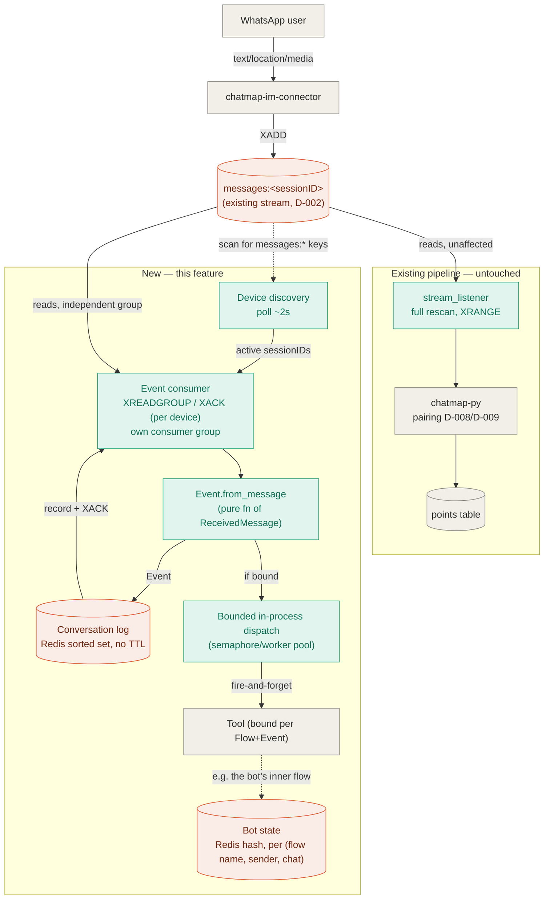

# Feature spec — Conversation engine (Flow / Event / Tool)

## Purpose

Give `chatmap-api` a generic, reusable engine that turns a sequence of
incoming chat messages from the same sender/chat into a tracked
**Conversation**, deterministically recognizes **Events** (facts) within it,
and fires configured **Tools** as side effects — as the foundation for a
future chatbot feature, built in parallel with the existing pipeline and
without modifying it.

## Scope

**In scope**

- The **Flow** definition model: a named config that binds `EventName`s to
  **Tools** (`tools_by_events: dict[EventName, Tool]`) and declares a
  per-Flow `window_time`. Multiple Flows can be registered side by side.
- A deterministic **Event detection** function, `Event.from_message`: a
  pure, pattern-matched mapping from a `ReceivedMessage`'s fields to one of a
  fixed set of `EventName`s (`USER_SEND_TEXT`, `USER_UPLOAD_PHOTO`,
  `USER_UPLOAD_PHOTO_WITH_TEXT`, `USER_SEND_COORDINATES`), or `None`.
- **Conversation** persistence: an append-only per-`(sender, chat)` log of
  Events, read back as a time-windowed slice around each incoming message.
- New Redis-consumer-group-based infrastructure (`RedisConsumer` base class)
  reading the existing `messages:<sessionID>` stream, coexisting with the
  existing full-rescan consumer.
- **Device discovery**: polling `messages:*` stream keys to find active
  sessionIDs (called "devices" in this code), so the engine doesn't need a
  static device list.
- Fire-and-forget **Tool dispatch**, bounded in-process concurrency, and the
  failure-isolation guarantee that makes bounding safe.
- One concrete Flow for v1, `HelpFlow`, used to exercise the engine end to
  end. Its bound Tool (`BotTool`) is not a stub — it's a real integration
  that delegates to the bot's own internal flow logic (see
  [Two layers of "Flow"](#two-layers-of-flow)). How that Tool composes and
  sends messages back to the user is documented separately, not here.

**Out of scope / deferred**

- Outbound message delivery mechanics — the `to_send` stream to
  `chatmap-im-connector`, message composition/encryption, and the bot's own
  internal flow logic. This is implemented and in active use (`BotTool` /
  `FirstTimeMappingFlow` send real replies), but is documented in a separate
  feature doc, not detailed here.
- Re-implementing photo/coordinate pairing or Postgres point creation.
  [D-008](../how-it-works/live_mode.md#d-008-pairing-window-constant) and
  [D-009](../how-it-works/live_mode.md#d-009-pairing-match-criteria) are
  untouched; `chatmap-py` is not modified.
- Multi-Flow selection/arbitration. Today exactly one Flow (`HelpFlow`) is
  registered and it subscribes to every `EventName`, so no arbitration is
  exercised yet. Note this is no longer the same problem the original plan
  deferred: a Conversation isn't "owned" by a Flow the way a first draft of
  this spec assumed (see [Decisions](#decisions)) — `Flow` is purely an
  event→Tool router, so if a second Flow bound the same `EventName`, both
  Tools would fire independently. Whether that's the desired behavior once a
  second Flow exists is still open.
- Flow/Conversation completion signaling — there is no engine-level
  `on_complete` hook or completion flag (see [Decisions](#decisions)). Note
  the bot's own internal flow does track its own completion
  (`FirstTimeMappingState.MAPPING_COMPLETED`), but that's a Tool-level
  concern, not something the engine provides generically.
- A durable tool-dispatch queue / exactly-once delivery — at-least-once is
  accepted, with documented limitations, rather than built around.

## Entity model

| Concept          | Definition                                                                                                                                                                                                                                                                            |
|------------------|---------------------------------------------------------------------------------------------------------------------------------------------------------------------------------------------------------------------------------------------------------------------------------------|
| **Flow**         | Named config: `tools_by_events: dict[EventName, Tool]` plus a per-Flow `window_time`. No ordering/prerequisite primitive at the engine level. Multiple Flows may be registered; each independently reacts to whichever `EventName`s it binds, and a Conversation isn't scoped to one. |
| **Event**        | A fact that has already happened, recognized by `Event.from_message` — a deterministic, pure pattern-match over a `ReceivedMessage`'s fields alone (no Conversation context, no pluggable registry).                                                                                  |
| **Conversation** | An append-only log of Events for one `(hashed sender, hashed chat)` key. Not a Flow-scoped, lifecycle-managed instance — see [Contract](#contract) for how it's actually persisted and read.                                                                                          |
| **Tool**         | Bound per `(Flow, Event)` — a single Tool fires on every occurrence of its bound Event (no first/repeat distinction). Fire-and-forget, non-blocking, failures logged.                                                                                                                 |

### Two layers of "Flow"

There are two distinct things named "Flow" in this codebase, at different
layers:

- **`conversation_engine.flow.Flow`** (e.g. `HelpFlow`) is the engine-level
  Flow described by this spec: a config that routes `EventName`s to Tools.
  It has no notion of state, sequence, or prerequisites.
- **`bot.flow.BotFlow`** (e.g. `FirstTimeMappingFlow`) is a Flow in the bot's
  own, separate sense: an explicit state machine
  (`(state, EventName) → handler` transitions over an `Enum` like
  `IDLE`/`WAITING_LANG`/`WAITING_PHOTO`/`WAITING_COORDINATES`/
  `MAPPING_COMPLETED`), persisted independently via `BotStateStore` — a
  Redis **hash** keyed `bot_state:<flow name>:<sender><chat>` (not the
  Conversation log). Keying by flow name, not just sender/chat, lets
  different bot flows hold independent, concurrent state for the same user —
  previously a user could only be "inside" one bot flow at a time. The hash
  also carries extra fields alongside `state` (currently `lang`, the user's
  chosen `Language`), read back as a full hash on `create()` rather than a
  single field.

This matches the spirit of the original design: engine Flows route Events to
Tools, and the bot itself is realized as one such Tool (`BotTool`), which in
turn runs its own internal flow. Sequencing/ordering — which the original
plan expected the engine to provide generically — ended up living entirely
in this bot-specific state machine instead (see
[Decisions](#decisions)). The mechanics of that inner flow (message
composition, translations, sending) are covered by a separate doc, not this
one.

## Diagram

```mermaid
flowchart TD
    whatsapp["WhatsApp user"]
    connector["chatmap-im-connector"]
    stream[("messages:&lt;sessionID&gt;<br/>(existing stream, D-002)")]

    subgraph existing["Existing pipeline — untouched"]
        oldconsumer["stream_listener<br/>full rescan, XRANGE"]
        chatmappy["chatmap-py<br/>pairing D-008/D-009"]
        postgres[("points table")]
    end

    subgraph new["New — this feature"]
        devices["Device discovery<br/>poll ~2s"]
        stateconsumer["Event consumer<br/>XREADGROUP / XACK (per device)<br/>own consumer group"]
        detect["Event.from_message<br/>(pure fn of ReceivedMessage)"]
        convhash[("Conversation log<br/>Redis sorted set, no TTL")]
        bound["Bounded in-process dispatch<br/>(semaphore/worker pool)"]
        tool["Tool (bound per Flow+Event)"]
        botstate[("Bot state<br/>Redis hash, per (flow name, sender, chat)")]
    end

    whatsapp -->|text/location/media| connector
    connector -->|XADD| stream
    stream -->|reads, unaffected| oldconsumer
    oldconsumer --> chatmappy --> postgres
    stream -.->|scan for messages:* keys| devices
    devices -->|active sessionIDs| stateconsumer
    stream -->|reads, independent group| stateconsumer
    stateconsumer --> detect
    detect -->|Event| convhash
    convhash -->|record + XACK| stateconsumer
    detect -->|if bound| bound
    bound -->|fire-and-forget| tool
    tool -.->|e.g. the bot's inner flow| botstate

    classDef redis fill:#FAECE7,stroke:#D85A30,color:#712B13;
    classDef consumer fill:#E1F5EE,stroke:#1D9E75,color:#0F6E56;
    classDef ext fill:#F1EFE8,stroke:#888780,color:#2C2C2A;
    class stream,convhash,botstate redis
    class stateconsumer,oldconsumer,detect,bound,devices consumer
    class whatsapp,connector,chatmappy,postgres,tool ext
```

## Behavior

| Situation                                     | Trigger                                                                                                                   | Observable result                                                                                                                                                                                                                                                                                                 |
|-----------------------------------------------|---------------------------------------------------------------------------------------------------------------------------|-------------------------------------------------------------------------------------------------------------------------------------------------------------------------------------------------------------------------------------------------------------------------------------------------------------------|
| Brand-new sender/chat                         | Message matches an Event for a registered Flow                                                                            | Event appended to that key's log; the Flow's bound Tool fires                                                                                                                                                                                                                                                     |
| Continuing conversation                       | Message matches an Event not yet seen in the current window                                                               | Event appended to the log; the bound Tool fires                                                                                                                                                                                                                                                                   |
| Repeated fact                                 | Message matches an Event already present in the current window                                                            | Event appended again (not overwritten, not discarded) as a separate log entry; the same bound Tool fires again — there's no separate on_first/on_repeat hook                                                                                                                                                      |
| Conversation window                           | Every incoming message                                                                                                    | The log isn't a lifecycle-managed "active conversation" instance — there's no creation step and no staleness boundary. Each message just re-queries the same ever-growing per-key log for entries within `± window_time` of that message's own timestamp                                                          |
| Unrelated message                             | Message doesn't match any `EventName` (e.g. video/audio/file-only messages currently produce no Event)                    | Ignored by this engine entirely; existing pipeline (`chatmap-py` pairing, Postgres writes) proceeds exactly as today, untouched                                                                                                                                                                                   |
| All Events satisfied                          | Every Event a Flow cares about becomes true for a given key                                                               | No special handling at the engine level — no flag, no hook. (The bot's own internal flow does track its own completion via `BotStateStore`, but that's Tool-level, not engine-provided.)                                                                                                                          |
| Tool call fails                               | A dispatched Tool raises/returns an error                                                                                 | Caught and logged at the dispatch site; does not affect Conversation state or consume dispatch capacity permanently                                                                                                                                                                                               |
| Concurrency limit reached                     | More Tool calls triggered than the bounded concurrency limit                                                              | Excess dispatches wait in-process for a free slot; state consumer's stream reads/acks are not blocked                                                                                                                                                                                                             |
| Crash after ack, before/during Tool execution | Process dies while a dispatched Tool call is queued or executing                                                          | That dispatch is lost — message was already acked, so there is no redelivery, and the in-process queue/semaphore does not survive a crash. **Accepted limitation for v1.**                                                                                                                                        |
| Crash before ack completes                    | Process dies between recording an Event and completing the log-write + `XACK`                                             | Entry is redelivered on restart (PEL reclaimed at startup); redetection looks like a genuine occurrence (indistinguishable from a real one) and may re-fire the bound Tool. **Accepted limitation — narrow window, low probability, since no I/O other than the log-write + ack sits between detection and ack.** |
| Old and new consumers on the same stream      | Both the existing full-rescan consumer and the new consumer-group-based consumer read `messages:<sessionID>` concurrently | No interference — independent Redis consumer groups (and the old consumer's plain `XRANGE`) don't conflict. New consumer(s) must ack fast enough to stay ahead of the old consumer's `XDEL` cleanup (based on `EXPIRING_MIN`)                                                                                     |

## Contract

**Flow config**

- `name`
- `tools_by_events: dict[EventName, Tool]` — which Tool fires for which
  `EventName`. No ordering/prerequisite primitive.
- `window_time` (duration, `ClassVar`) — declared per-Flow (e.g. `HelpFlow`
  sets 2 minutes), but not yet wired end to end: the consumer currently
  passes a hardcoded `timedelta(minutes=2)` literal into `ConversationStore.load`
  rather than reading it from the triggering Flow instance.

**Event**

- Produced by `Event.from_message(message)` — a single pure pattern-match
  function, not a per-Event pluggable registry
- Returns `None` when no case matches (e.g. video/audio/file-only messages
  currently produce no Event and are invisible to the engine)
- Pure function of the message envelope alone; no Conversation context

**Conversation**

- Keyed by `ConversationKey(sender, chat)` → Redis key
  `conversation:<hashed sender>:<hashed chat>` (same hashed partitioning
  [D-009](../how-it-works/live_mode.md#d-009-pairing-match-criteria) uses)
- Persisted as a Redis **sorted set**: `ZADD` with member `event.key()`
  (`f"{timestamp}:{name}"`) and score = the event's timestamp
- No TTL — entries are never expired or pruned; the set grows indefinitely
- Read via `ZRANGEBYSCORE` over `[target_time - window_time, target_time +
  window_time]` — a window centered on each new message's own timestamp, not
  a since-last-activity cutoff
- `Conversation.log` / `Conversation.events_viewed` are reconstructed fresh
  from that windowed read on every message; nothing is cached across calls

**Tool**

- Async callable receiving: the detected `Event`, the raw `ReceivedMessage`,
  the device id, and the `Conversation` (its windowed log)
- No return value is consumed by the engine — pure side effect
- Must be non-blocking / async-native; a blocking Tool implementation defeats the fire-and-forget guarantee
- Failure is caught and logged at the dispatch site; must never permanently consume a worker/semaphore permit

**Device discovery**

- `Devices.get_active_devices(client)` scans for keys matching `messages:*`
  of type `stream` and strips the `messages:` prefix to yield each device id
  (the sessionID, per [D-010](../how-it-works/live_mode.md#d-010-one-session-one-device))
- `ConversationsStateListener.start()` polls this list every ~2 seconds; for
  each active device it lazily ensures a consumer group exists on that
  device's stream and drains currently-available messages
- The consumer group/consumer names (`cli-group` / `cli-consumer`) are fixed
  constants applied independently per per-device stream key, so reusing them
  across devices doesn't collide

## Decisions

1. **New engine uses real Redis consumer groups (`XREADGROUP`/`XACK`)**, diverging
   from [D-005](../how-it-works/live_mode.md#d-005-in-process-full-rescan-consumer)'s `DEFAULT` (full rescan, no groups,
   no ack tracking). Needed for PEL-based crash recovery and per-message-once(ish) semantics that a stateful
   Conversation model depends on. Safe to coexist: Redis allows independent consumer groups (and ungrouped `XRANGE`
   reads) on the same stream without interference.
2. **New engine must ack entries before they age past `EXPIRING_MIN`** and get `XDEL`'d by the existing consumer's
   cleanup. Internal to `chatmap-api`; no cross-service impact, so this doesn't need architecture escalation.
3. **Tool binding lives on `(Flow, Event)`, not on Event itself.** The same Event can trigger different Tools in
   different Flows. A bound Tool fires on every occurrence of its Event — there are no separate on_first/on_repeat
   slots. Discarded: binding Tool globally to an Event — less flexible, didn't match the intended usage.
4. **An Event is an already-occurred fact, not an expectation.** Detection only fires once the corresponding message has
   actually arrived.
5. **No generic ordering/prerequisite primitive in the engine.** The original plan called for an optional
   `prerequisite_state_ids` list per State; this was never built. Sequencing, where a Flow's Tool needs it, is
   implemented by that Tool itself instead — e.g. the bot's own internal flow encodes
   `IDLE → WAITING_LANG → WAITING_PHOTO → WAITING_COORDINATES → MAPPING_COMPLETED` as an explicit state machine,
   persisted separately via `BotStateStore`, entirely outside the conversation engine (see
   [Two layers of "Flow"](#two-layers-of-flow)).
6. **Event detection stays a pure function of the message alone** (`Event.from_message`) — no Conversation-history
   awareness, no Flow awareness. Keeps detection simple and swappable independent of engine/Flow mechanics.
7. **Occurrences are appended, never overwritten or discarded.** `ZADD` gives every Event its own distinct member
   (`timestamp:name`), so repeats of the same `EventName` remain in the log as separate entries. Discarded: starting a
   brand-new Conversation on every message — would lose visibility into prior Events entirely. No first/repeat
   distinction is made at the Tool-dispatch level (see decision 3) — a bound Tool simply fires again on a repeat.
8. **Conversation matching key = (hashed sender, hashed chat)** — same
   partitioning [D-009](../how-it-works/live_mode.md#d-009-pairing-match-criteria) already uses.
9. **No completion signal at the engine level.** No `on_complete` hook, no completion flag. Keeps the engine's
   responsibility minimal. (The bot's own internal flow tracks its own completion as a Tool-level concern — see
   [Two layers of "Flow"](#two-layers-of-flow) — but nothing generic is provided or planned at the engine layer.)
10. **Tool dispatch is fire-and-forget, bounded by an in-process concurrency limit** (semaphore or small worker pool —
    an implementation detail, not part of this contract). Keeps the state consumer's throughput independent of Tool
    latency or failure, per decision 2's speed requirement.
11. **A Tool call failure must never permanently consume dispatch capacity.** Caught and logged at the dispatch site.
    Discarded: letting exceptions propagate — would silently shrink the effective concurrency pool to zero over repeated
    failures (a worker loop dying, or a semaphore permit leaking).
12. **Ack is not gated on Tool completion.** Log-write + `XACK` happen immediately after Event detection/recording,
    regardless of whether/when the bound Tool runs. Keeps the crash-duplicate window minimal (a couple of Redis calls,
    no external I/O) instead of tied to Tool latency.
13. **No atomic bundling (`MULTI`/`EXEC` or Lua) of log-write + `XACK`** for v1 — the residual risk is already small
    and documented; added complexity not justified yet.
14. **No durable (Redis-backed) tool-dispatch queue for v1.** An in-process bounded primitive is used instead, accepting
    that a crash while a dispatch is queued/executing after ack can silently lose that dispatch. Building durability for
    a Tool that doesn't exist yet is premature — revisit once the real chatbot Tool reveals actual load/failure
    characteristics.
15. **This feature does not modify `chatmap-py` or `stream_listener`.** Built and deployed in parallel, reading the same
    `messages:<sessionID>` stream ([D-002](../how-it-works/live_mode.md#d-002-stream-key-contract)). Migration/cutover
    of the existing pairing logic to this engine is explicitly out of scope and left for later.
16. **Flow is a pure event→Tool router, decoupled from Conversation lifecycle.** `Flows.call_tools_for` dispatches to
    every registered Flow whose bound events include the incoming Event, independent of any Conversation state. A
    Conversation is a shared per-key log any Tool can read, not a per-Flow instance. Keeps Flow config maximally
    simple (a dict) and lets a Flow's Tool encode whatever process/ordering it needs on top, without engine
    involvement.
17. **Conversation window is symmetric and computed at query time, not a stored lifecycle boundary.** No TTL, no
    explicit creation/staleness step — `ConversationStore.load` re-queries a `± window_time` slice around each
    message's own timestamp from an ever-growing sorted set. Simplest thing that gives a Tool "nearby context";
    real lifecycle/expiry (matching the original v1 "Conversation hash + TTL" plan) is deferred until a concrete need
    for pruning appears.
18. **Device discovery is dynamic and polling-based.** `Devices.get_active_devices` scans `messages:*` stream keys
    every ~2s rather than requiring a static/configured device list; a per-device consumer group is created lazily on
    first sight. sessionIDs/devices come and go as WhatsApp accounts link/unlink
    ([D-010](../how-it-works/live_mode.md#d-010-one-session-one-device)), and the engine has no other channel to learn
    about them.
19. **Bot state is keyed by `(flow name, sender, chat)`, not just `(sender, chat)`.** `BotStateStore`'s Redis hash key
    is `bot_state:<flow name>:<sender><chat>`. With just `(sender, chat)`, a user could only be mid-progress in one
    bot flow at a time — starting a second bot flow would silently stomp the first's state. Keying by flow name too
    lets multiple bot flows track independent, concurrent progress for the same user. The hash also stores arbitrary
    fields beyond `state` (currently `lang`), so a bot flow can persist its own small pieces of context — like the
    user's chosen language — alongside its state, fetched back as a full hash rather than a single field.

## Open questions

- Exact bounded-concurrency primitive (semaphore vs. explicit worker pool)
  and its size — implementation detail, doesn't block this spec.
