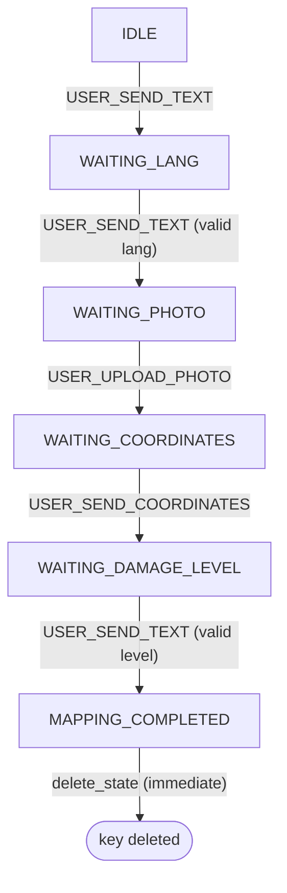

# Feature spec — First-time mapping bot flow: fallback recovery prompt

## Context

`FirstTimeMappingFlow` (`bot/flows/first_time_mapping/flow.py`) is the bot's
internal state machine for onboarding a new mapper: pick a language, send a
photo, send coordinates, rate the damage level. It's a `Tool` bound inside
the conversation engine (see
[conversation_engine.md](conversation_engine.md#two-layers-of-flow)), but its
own state machine — `FirstTimeMappingState`, the `transitions` table, and
`on_fallback` — is entirely internal, persisted via `BotStateStore`,
independent of the engine's `Conversation`/`Event` model.



`call()` dispatches on `(state, EventName)` against the `transitions` table.
No entry for the pair → `on_fallback`. Two handlers (`on_ask_for_lang`,
`on_damage_level_answered`) additionally re-ask directly, without going
through `on_fallback`, when the event *does* match but the answer's value is
invalid (e.g. an out-of-range option number) — that pattern is unchanged by
this feature.

This spec covers a new behavior layered on top of `on_fallback`: after 3
consecutive fallbacks, the 4th offers the user a way out instead of repeating
the same re-ask forever.

## Purpose

Give the user stuck in a fallback loop — 4 consecutive events the flow
couldn't handle — an explicit choice to cancel the mapping or restart it from
the beginning, instead of silently repeating the same re-ask indefinitely.

## Scope

**In scope**

- A per-conversation `fallback_count`, persisted in the same
  `BotStateStore` hash as `state`/`lang`/`point_id`.
- On the 4th consecutive `on_fallback` call, replace the normal per-state
  re-ask with a cancel/restart prompt, and move to a new state,
  `WAITING_RECOVERY_CHOICE`.
- Handling the user's answer to that prompt: cancel (delete the flow's
  state) or restart (jump back to the language question).
- New `messages.json` entries (all 4 languages) for the prompt, its two
  options, and the cancellation confirmation.

**Out of scope / deferred**

- `MAPPING_COMPLETED`'s existing `on_fallback` branch — untouched, not part
  of the counter (see [Decisions](#decisions), #6).
- Anything in the conversation engine itself (`Flow`/`Event`/`Tool`) — this
  feature is entirely internal to `FirstTimeMappingFlow`'s own state
  machine.
- The existing "invalid option, re-ask directly" behavior in
  `on_ask_for_lang` / `on_damage_level_answered` — still bypasses
  `on_fallback` entirely, exactly as today.
- Recording/reporting abandoned mappings (analytics on cancellations) — not
  requested, nothing in the codebase tracks this today.

## Behavior

| Situation | Trigger | Observable result |
|---|---|---|
| 1st–3rd consecutive fallback | `call()` finds no transition for `(state, event)`; `fallback_count` was 0, 1, or 2 | `fallback_count` incremented and persisted (state unchanged); generic fallback message + existing per-state re-ask sent — unchanged from today |
| 4th consecutive fallback | Same, but `fallback_count` was already 3 | Instead of the per-state re-ask: sends the recovery prompt (cancel/restart options), saves `state=WAITING_RECOVERY_CHOICE` with `fallback_count=4` |
| 5th+ consecutive fallback, already in `WAITING_RECOVERY_CHOICE` | User sends an event type that still doesn't match any transition (e.g. a photo instead of typing 1/2) | Re-shows the same recovery prompt; `fallback_count` keeps growing but has no further observable effect — no special-casing needed since the threshold check runs before the per-state `match` |
| Recovery answer = cancel | `(WAITING_RECOVERY_CHOICE, USER_SEND_TEXT)`, answer is the "cancel" option | `delete_state` (whole Redis hash key removed) + cancellation message sent; next user message starts fresh from `IDLE` |
| Recovery answer = restart | `(WAITING_RECOVERY_CHOICE, USER_SEND_TEXT)`, answer is the "restart" option | Delegates to `on_ask_for_help`: sends the language question, saves `state=WAITING_LANG` with `fallback_count` reset to `"0"` |
| Recovery answer invalid | `(WAITING_RECOVERY_CHOICE, USER_SEND_TEXT)`, answer isn't the cancel/restart option | Re-sends the recovery prompt; no `save_state` call — same pattern as the existing invalid-option handlers |
| Genuine state advance | Any existing handler's success path (valid language, photo uploaded, coordinates sent, valid damage level) | `fallback_count` explicitly reset to `"0"` as part of that handler's existing `save_state` call |
| Fallback while `state == MAPPING_COMPLETED` | Practically unreachable — the state's Redis key is deleted immediately after being set, so no later event can ever be dispatched against a live `MAPPING_COMPLETED` state | Unchanged: sends only the generic fallback message, no `save_state`, not counted — purely defensive dead branch |

## Contract

**`fallback_count` field**

- Stored as a string integer in the existing `bot_state:<flow
  name>:<sender><chat>` hash. Absent field == `0`.
- Only two kinds of writes touch it: an explicit reset to `"0"` on a genuine
  state advance, or an explicit increment on an `on_fallback` call. No other
  code path touches it.

**Threshold**

- `FALLBACK_LIMIT = 3` (module-level constant). `on_fallback` computes
  `count = int(fetched or 0) + 1`; `count > FALLBACK_LIMIT` triggers the
  recovery prompt instead of the per-state branch.

**New state**

- `FirstTimeMappingState.WAITING_RECOVERY_CHOICE`, added to the existing
  enum.

**New transition**

- `(WAITING_RECOVERY_CHOICE, EventName.USER_SEND_TEXT) → on_recovery_choice_answered`

**`on_fallback` structure**

```
count = fetched fallback_count + 1

if count > FALLBACK_LIMIT:
    send recovery prompt
    save_state(state=WAITING_RECOVERY_CHOICE, bot_info={"fallback_count": str(count)})
    return

send generic fallback message
match self.state:
    IDLE | WAITING_LANG:
        send language question directly (no longer delegates to on_ask_for_help)
        save_state(state=WAITING_LANG, bot_info={"fallback_count": str(count)})
    WAITING_PHOTO:
        send photo re-ask
        save_state(state=WAITING_PHOTO, bot_info={"fallback_count": str(count)})   # new: this branch didn't save_state before
    WAITING_COORDINATES:
        send coordinates re-ask
        save_state(state=WAITING_COORDINATES, bot_info={"fallback_count": str(count)})  # new
    WAITING_DAMAGE_LEVEL:
        send damage-level re-ask
        save_state(state=WAITING_DAMAGE_LEVEL, bot_info={"fallback_count": str(count)})  # new
    MAPPING_COMPLETED:
        send generic fallback message only — unchanged, no save_state
```

**New `messages.json` keys** (all 4 languages — ES/EN/PT/FR), final copy:

| Language | `recovery_question` | `recovery_options` | `flow_cancelled` |
|---|---|---|---|
| ES | "No estamos logrando avanzar. ¿Querés cancelar el mapeo o reiniciarlo desde el principio?" | `{"1": "Cancelar", "2": "Reiniciar"}` | "Mapeo cancelado. Cuando quieras, escribime para empezar de nuevo. 👋" |
| EN | "We're not making progress. Do you want to cancel the mapping or restart it from the beginning?" | `{"1": "Cancel", "2": "Restart"}` | "Mapping cancelled. Whenever you're ready, send me a message to start again. 👋" |
| PT | "Não estamos conseguindo avançar. Você quer cancelar o mapeamento ou reiniciá-lo desde o início?" | `{"1": "Cancelar", "2": "Reiniciar"}` | "Mapeamento cancelado. Quando quiser, me mande uma mensagem para começar de novo. 👋" |
| FR | "On n'avance pas. Tu veux annuler le mapping ou le recommencer depuis le début ?" | `{"1": "Annuler", "2": "Recommencer"}` | "Mapping annulé. Quand tu veux, envoie-moi un message pour recommencer. 👋" |

## Decisions

1. **The counter only increments on genuine `on_fallback` invocations** —
   unmatched `(state, event)` pairs dispatched from `call()` — not on the
   existing invalid-option re-asks inside `on_ask_for_lang` /
   `on_damage_level_answered`, which don't go through `on_fallback` today
   and still won't. Matches the literal trigger: "falling into
   `on_fallback`," not "any wrong answer."
2. **The counter resets to `0` only on genuine state advances**, not on any
   matched-handler dispatch. Every handler's existing successful
   `save_state` call gets `fallback_count: "0"` added to its `bot_info`.
   Discarded: resetting on any matched-handler dispatch regardless of
   outcome — would also reset on invalid-option re-asks, which aren't real
   progress.
3. **`on_fallback` no longer delegates to `on_ask_for_help` for
   `IDLE`/`WAITING_LANG`** — it inlines sending the language prompt and its
   own `save_state` call, like the other three per-state branches already
   do. Necessary so `on_fallback` stays the sole owner of its own
   `fallback_count` write for those two states: delegating would let
   `on_ask_for_help`'s own reset-to-`0` stomp the increment `on_fallback`
   just made, since Redis `HSET` merge means whichever `save_state` call
   happens last for that key wins.
4. **`WAITING_PHOTO`, `WAITING_COORDINATES`, `WAITING_DAMAGE_LEVEL` branches
   of `on_fallback` gain a `save_state` call they don't have today** (state
   unchanged, only `fallback_count` persisted). Necessary because the
   counter must survive across requests — a new `FirstTimeMappingFlow`
   instance is rebuilt from Redis on every event — and today those branches
   skip `save_state` entirely since nothing needed persisting.
5. **The threshold check runs before the per-state `match` in
   `on_fallback`, and short-circuits it entirely once crossed** — regardless
   of which state the user was in. This also covers "fallback happens again
   while already in `WAITING_RECOVERY_CHOICE`" without a dedicated case: it
   just re-shows the same recovery prompt, since the count stays above
   `FALLBACK_LIMIT`.
6. **`MAPPING_COMPLETED`'s existing `on_fallback` branch is untouched and
   excluded from the counter.** It's dead in practice —
   `on_damage_level_answered` calls `delete_state` immediately after
   `save_state`, so no later event can ever be dispatched against a live
   `MAPPING_COMPLETED` state; the `match` case is purely defensive.
7. **"Restart" reuses `on_ask_for_help` as-is** (send language prompt,
   `save_state(state=WAITING_LANG, bot_info={"fallback_count": "0"})`),
   without an explicit `delete_state` first. Discarded: clearing the whole
   hash before restarting — no observable benefit today, since `lang` /
   `point_id` are unconditionally overwritten before a fresh pass through
   the flow would ever read them again.
8. **"Cancel" calls `delete_state`** (same call `on_damage_level_answered`
   already uses on completion) plus a new farewell message. No other side
   effect — nothing in the codebase tracks abandonment today, and adding
   that wasn't requested.
9. **Invalid answers to the recovery prompt re-send it without any
   `save_state` call** — mirrors the existing invalid-option pattern in
   `on_ask_for_lang` / `on_damage_level_answered`, keeping the new handler
   consistent with the rest of the flow.

## Open questions

None — all decisions above are settled.
