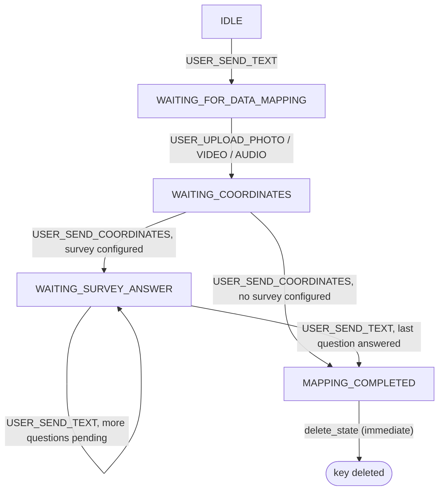

# Feature spec — First-time mapping bot flow: fallback recovery prompt

## Context

`FirstTimeMappingFlow` (`bot/flows/first_time_mapping/flow.py`) is the bot's
internal state machine for onboarding a new mapper: send a photo, video, or
audio, send its coordinates, then answer whatever survey questions the map
owner configured (if any) — single choice or free text, see
[bot_setup.md](bot_setup.md). It's a `Tool` bound inside the
conversation engine (see
[conversation_engine.md](conversation_engine.md#two-layers-of-flow)), but its
own state machine — `FirstTimeMappingState`, the `transitions` table, and
`on_fallback` — is entirely internal, persisted via `BotStateStore`,
independent of the engine's `Conversation`/`Event` model.



`call()` dispatches on `(state, EventName)` against the `transitions` table.
No entry for the pair → `on_fallback`. Two handlers (`on_survey_answered`,
`on_recovery_choice_answered`) additionally re-ask directly, without going
through `on_fallback`, when the event *does* match but the answer's value is
invalid (an unrecognized option number) — that pattern is unchanged by this
feature.

This spec covers a behavior layered on top of `on_fallback`: after enough
consecutive fallbacks, the next one offers the user a way out instead of
repeating the same re-ask forever.

## Purpose

Give the user stuck in a fallback loop an explicit choice to cancel the
mapping or restart it from the beginning, instead of silently repeating the
same re-ask indefinitely.

## Scope

**In scope**

- A per-conversation `fallback_count`, persisted in the same
  `BotStateStore` hash as `state`/`point_id`.
- Once fallbacks exceed the map owner's configured threshold, replace the
  normal per-state re-ask with a cancel/restart prompt, and move to
  `WAITING_RECOVERY_CHOICE`.
- Handling the user's answer to that prompt: cancel (delete the flow's
  state) or restart (jump back to `IDLE`'s greeting).
- The prompt's content (question + both option labels + the threshold
  itself) is configured per map owner via `BotConfiguredMessagesStore`
  (`BotStep.MAX_ATTEMPTS`), not hardcoded.

**Out of scope / deferred**

- `MAPPING_COMPLETED`'s existing `on_fallback` branch — untouched, not part
  of the counter (see [Decisions](#decisions), #6).
- Anything in the conversation engine itself (`Flow`/`Event`/`Tool`) — this
  feature is entirely internal to `FirstTimeMappingFlow`'s own state
  machine.
- The existing "invalid option, re-ask directly" behavior in
  `on_survey_answered` / `on_recovery_choice_answered` — still bypasses
  `on_fallback` entirely, exactly as today.
- Recording/reporting abandoned mappings (analytics on cancellations) — not
  requested, nothing in the codebase tracks this today.

## Behavior

| Situation | Trigger | Observable result |
|---|---|---|
| Below-threshold fallback | `call()` finds no transition for `(state, event)`; stored `fallback_count` is still `≤ max_attempts_quantity` | Per-state re-ask sent (`error_of(step)` + `text_of(step)`, or the pending survey question's own `error_message` + options); `fallback_count` incremented afterward |
| Threshold-crossing fallback | Same, but stored `fallback_count` is already `> max_attempts_quantity` | Instead of the per-state re-ask: sends `max_attempts_messages.full_message()` (the recovery prompt with both options inlined), saves `state=WAITING_RECOVERY_CHOICE`. `fallback_count` is *not* incremented on this call (see [Contract](#contract)) |
| Further fallback while already in `WAITING_RECOVERY_CHOICE` | User sends an event type that still doesn't match any transition (e.g. a photo instead of typing 1/2) | Re-shows the same recovery prompt — the stored count is still above threshold, so the same branch fires again |
| Recovery answer = cancel | `(WAITING_RECOVERY_CHOICE, USER_SEND_TEXT)`, answer is `max_attempts_messages.to_cancel` | `delete_state` (whole Redis hash key removed); **no message is sent** — see [Known gaps](#known-gaps-vs-this-spec) |
| Recovery answer = restart | `(WAITING_RECOVERY_CHOICE, USER_SEND_TEXT)`, answer is `max_attempts_messages.to_restart` | Delegates to `on_start`: sends the greeting + media prompt, saves `state=WAITING_FOR_DATA_MAPPING` |
| Recovery answer invalid | `(WAITING_RECOVERY_CHOICE, USER_SEND_TEXT)`, answer isn't the cancel/restart option | Re-sends the recovery prompt (`full_message()`); no `save_state` call — same pattern as the existing invalid-option handlers |
| Genuine state advance | Any existing handler's success path (data uploaded, coordinates sent, a survey question answered) | `fallback_count` is **not** reset — see [Known gaps](#known-gaps-vs-this-spec) |
| Fallback while `state == MAPPING_COMPLETED` | Practically unreachable — the state's Redis key is deleted immediately after being set, so no later event can ever be dispatched against a live `MAPPING_COMPLETED` state | `match` has no case for it: nothing is sent, but `fallback_count` still increments — purely defensive dead branch |

## Contract

**`fallback_count` field**

- Stored as a string integer in the existing `bot_state:<flow
  name>:<sender><chat>` hash. Absent field == `0`.
- Only one kind of write touches it today: an explicit increment
  (`BotStateStore.increment_fallback_count`, a Redis `HINCRBY`) at the end
  of every `on_fallback` call whose count was still at or below threshold.
  **Nothing resets it** — see [Known gaps](#known-gaps-vs-this-spec).

**Threshold**

- Not a module constant. `on_fallback` fetches the stored count and compares
  it against `ctx.configured_messages.max_attempts_messages
  .max_attempts_quantity` — a value the map owner configures per map, read
  from the `BotStep.MAX_ATTEMPTS` row via `BotConfiguredMessagesStore`.
- `count > max_attempts_quantity` triggers the recovery prompt instead of
  the per-state branch.

**New state**

- `FirstTimeMappingState.WAITING_RECOVERY_CHOICE`, part of the existing
  enum.

**New transition**

- `(WAITING_RECOVERY_CHOICE, EventName.USER_SEND_TEXT) → on_recovery_choice_answered`

**`on_fallback` structure** (matches `flow.py` today)

```
count = fetch stored fallback_count (0 if absent)

if count > configured_messages.max_attempts_messages.max_attempts_quantity:
    send max_attempts_messages.full_message()   # notify + both options, one string
    save_state(state=WAITING_RECOVERY_CHOICE)   # fallback_count left untouched
    return

match self.state:
    IDLE:
        send text_of(START), text_of(MEDIA)
    WAITING_FOR_DATA_MAPPING:
        send error_of(MEDIA), text_of(MEDIA)
    WAITING_COORDINATES:
        send error_of(LOCATION), text_of(LOCATION)
    WAITING_SURVEY_ANSWER:
        re-derive the pending question (SurveyResponsesStore + next_question_to_answer)
        send question.error_message, build_options_message(question.prompt, question.options)
    # WAITING_RECOVERY_CHOICE, MAPPING_COMPLETED: no case — nothing sent

increment_fallback_count(state_key)   # unconditional whenever this point is reached
```

**Message source**

- Recovery-prompt content is sourced the same way as every other bot step —
  from `BotConfiguredMessagesStore` (Postgres, per map owner), not from the
  repo's `bot/flows/first_time_mapping/messages.json`. That file is dead:
  nothing in the codebase reads it anymore (it still has stale `ES/EN/PT/FR`
  entries, including a language-selection question and a fixed
  "damage level" question, from before both were removed/generalized).
- The `MAX_ATTEMPTS` row carries `max_attempts_quantity` (int),
  `content`/`notify_message`, `to_restart`, `to_cancel`.
  `BotMaxAttemptsMessages.full_message()` builds one string:
  `f"{notify_message} {to_cancel}, {to_restart}"` — there's no separate
  numbered-options rendering here, unlike survey questions
  (`build_options_message`).

## Decisions

1. **The counter only increments on genuine `on_fallback` invocations** —
   unmatched `(state, event)` pairs dispatched from `call()` — not on the
   existing invalid-option re-asks inside `on_survey_answered` /
   `on_recovery_choice_answered`, which don't go through `on_fallback` today
   and still won't. Matches the literal trigger: "falling into
   `on_fallback`," not "any wrong answer."
2. **The counter was originally meant to reset to `0` on every genuine state
   advance**, so that "consecutive" meant consecutive within a step, not
   across the whole flow. **That reset isn't implemented** — no handler's
   `save_state` call touches `fallback_count` — so today the counter simply
   accumulates for the lifetime of the state key. See
   [Known gaps](#known-gaps-vs-this-spec).
3. **`on_fallback` doesn't delegate to a shared "ask again from scratch"
   helper for `IDLE`** — it inlines sending `text_of(START)` +
   `text_of(MEDIA)` directly, like the other per-state branches do.
4. **`WAITING_FOR_DATA_MAPPING`, `WAITING_COORDINATES`,
   `WAITING_SURVEY_ANSWER` branches of `on_fallback` each call `save_state`**
   (state unchanged, only `fallback_count` persisted) — necessary because
   the counter must survive across requests, since a new
   `FirstTimeMappingFlow` instance is rebuilt from Redis on every event.
5. **The threshold check runs before the per-state `match` in
   `on_fallback`, and short-circuits it entirely once crossed** — regardless
   of which state the user was in. This also covers "fallback happens again
   while already in `WAITING_RECOVERY_CHOICE`" without a dedicated case: it
   just re-shows the same recovery prompt, since the count stays above
   threshold (it's never incremented past this point either, since that
   branch returns before reaching `increment_fallback_count`).
6. **`MAPPING_COMPLETED`'s existing `on_fallback` branch is untouched and
   excluded in practice.** It's dead: `on_coordinates_sent` /
   `on_survey_answered` call `delete_state` immediately after completing the
   flow, so no later event can ever be dispatched against a live
   `MAPPING_COMPLETED` state; the `match` case is purely defensive (and
   absent — falling through does nothing but still increments the counter).
7. **"Restart" reuses `on_start` as-is**: greeting + media prompt,
   `save_state(state=WAITING_FOR_DATA_MAPPING)`. No explicit `delete_state`
   first, and no `fallback_count` reset either (see decision #2's gap) —
   `point_id` from a prior attempt is left in the hash until a fresh pass
   through the flow overwrites it.
8. **"Cancel" calls `delete_state` only.** There is no `BotStep` for a
   cancellation confirmation today, so nothing is sent back to the user —
   see [Known gaps](#known-gaps-vs-this-spec).
9. **Invalid answers to the recovery prompt re-send it without any
   `save_state` call** — mirrors the existing invalid-option pattern in
   `on_survey_answered`, keeping the new handler consistent with the rest of
   the flow.

## Known gaps vs. this spec

Found while updating this doc to match the current code — flagged rather
than silently documented away, since these look like unintentional drift
rather than deliberate simplifications:

- **`fallback_count` never resets.** A user who fumbles twice on the media
  step, succeeds, then fumbles twice on coordinates hits the recovery prompt
  on their 4th *total* mistake, not their 4th consecutive one at a single
  step — contradicting decision #2's original intent.
- **Cancelling sends no confirmation message**, unlike the `flow_cancelled`
  copy still sitting (unused) in `messages.json`. The user's last visible
  message is the recovery prompt itself; nothing tells them the cancellation
  went through.

## Open questions

None beyond the gaps above — those are implementation bugs to decide on
fixing, not open design questions.
