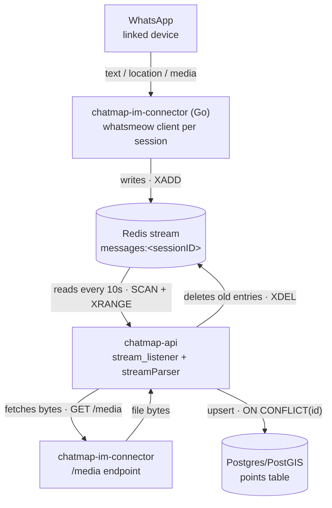

# Decision record — ChatMap Live: WhatsApp ingestion → Redis → Postgres

## System flow

## Decision index

| ID                                               | Statement                                                                                                                                               | Type      |
|--------------------------------------------------|---------------------------------------------------------------------------------------------------------------------------------------------------------|-----------|
| [D-001](#d-001-connector-service-boundary)       | Ingestion and processing are separate services connected only through a Redis stream and a narrow HTTP media-fetch endpoint                             | INVARIANT |
| [D-002](#d-002-stream-key-contract)              | Stream key format is `messages:<sessionID>`, and must match exactly between the Go connector and the Python API                                         | INVARIANT |
| [D-003](#d-003-point-id-determinism)             | Postgres `points.id` is deterministic, derived from the source Redis stream entry id, not randomly generated                                            | INVARIANT |
| [D-004](#d-004-encrypt-content-hash-identifiers) | Free-text content is reversibly encrypted (AES-256-GCM, shared symmetric key); sender/chat/account identifiers are irreversibly hashed (SHA-256)        | INVARIANT |
| [D-005](#d-005-in-process-full-rescan-consumer)  | The Redis consumer runs in-process inside the API, with no consumer group, re-reading the whole remaining stream every poll cycle                       | DEFAULT   |
| [D-006](#d-006-unified-message-envelope)         | All WhatsApp message types (text, location, media) are written through one Redis entry schema, with type-specific fields left empty                     | DEFAULT   |
| [D-007](#d-007-media-out-of-band)                | Media bytes are not put on the Redis stream; only a reference is queued, and bytes are fetched on demand by the consumer                                | DEFAULT   |
| [D-008](#d-008-pairing-window-constant)          | The message-to-coordinates pairing tolerance is a hardcoded 30-minute constant inside `chatmap-py`, independent of any Redis TTL config                 | DEFAULT   |
| [D-009](#d-009-pairing-match-criteria)           | A coordinates entry pairs with the nearest entry sharing the same hashed sender and hashed chat, found by bidirectional expanding search from its index | DEFAULT   |
| [D-010](#d-010-one-session-one-device)           | One `sessionID` maps to exactly one linked WhatsApp device/account at a time, via whatsmeow QR pairing                                                  | DEFAULT   |

---

### D-001. Connector service boundary

**Statement.** `chatmap-im-connector` (Go) and `chatmap-api` (Python) are
separate deployable services. Their only coupling is the Redis stream
(connector writes, API reads) plus a narrow HTTP `/media` endpoint the API
calls back to the connector to fetch media bytes. There is no direct database
access or RPC between them.

**Type.** INVARIANT.

**Rationale.** `docs/live.md` states the intent to add more IM bridges
(Telegram, Signal) beyond WhatsApp. A protocol-specific ingestion service that
only knows how to produce entries in a shared, protocol-agnostic Redis stream
format is what makes that extension possible without touching `chatmap-api`.
Collapsing the boundary (e.g. the API talking whatsmeow directly, or the
connector writing to Postgres directly) would tie storage/pairing logic to
one IM protocol's client library.

---

### D-002. Stream key contract

**Statement.** The Redis stream key is `messages:<sessionID>`, produced by
the connector (`fmt.Sprintf("messages:%s", sessionID)`) and independently
reconstructed by the API (`STREAM_KEY = "messages"` + session id discovered
via `SCAN messages:*`). Both sides must agree on this exact string format.

**Type.** INVARIANT.

**Rationale.** This is the entire interface between two independently
deployed, differently-typed codebases (Go / Python) — there is no schema
registry or compile-time check binding them. If either side changes the key
format unilaterally, the pipeline breaks silently (streams pile up unread, or
the consumer finds nothing).

---

### D-003. Point ID determinism

**Statement.** Each Postgres `Point.id` is not a fresh random UUID — it is
derived from the originating Redis stream entry id, which the connector
builds as `"<WhatsApp message epoch-ms>-0"`. `add_points()` upserts with
`ON CONFLICT (id) DO UPDATE`.

**Type.** INVARIANT.

**Rationale.** [D-005](#d-005-in-process-full-rescan-consumer) means the same
stream entry can be read and processed more than once (the consumer has no
offset/ack tracking and simply re-reads the remaining stream every cycle
until cleanup deletes old entries). Reprocessing is only safe *because* the
resulting `Point.id` is stable across re-runs — the upsert collapses repeats
into one row instead of creating duplicates. Breaking id determinism would
break the safety of the current consumer design.

---

### D-004. Encrypt content, hash identifiers

**Statement.** Free-text content — message bodies and media captions — is
encrypted with AES-256-GCM using a symmetric key (`CHATMAP_ENC_KEY`) that is
configured identically on both the Go connector and the Python API, and is
reversible (`chatmap-api` decrypts it before storing/serving points). Sender
JID, chat JID, and account JID are instead hashed with SHA-256 before ever
reaching Redis — a one-way transform, never reversed.

**Type.** INVARIANT.

**Rationale.** This is the system's current privacy boundary: message
content is recoverable (needed to display it on the map), while WhatsApp
identifiers are not (they're only used internally for grouping/pairing, per
[D-009](#d-009-pairing-match-criteria), never displayed or reversed).
Location coordinates are treated as neither — sent in the clear, since they
are the map payload itself.

---

### D-005. In-process, full-rescan consumer

**Statement.** The Redis-reading side lives inside the same process as the
FastAPI HTTP server, started as `asyncio.create_task(stream_listener())` at
API startup — it is not a separate worker/service. On every cycle
(`STREAM_LISTENER_TIME`, default 10s) it discovers all `messages:*` keys and
runs `XRANGE` over the **entire** remaining stream, not just entries added
since the last read. `CONSUMER_GROUP`/`CONSUMER_NAME` are defined in
`settings.py` but are not used anywhere in the current code path — no
`XREADGROUP`/`XACK` is issued.

**Type.** DEFAULT.

**Rationale.** This is an implementation/deployment-topology choice, not a
domain rule — it can change (e.g. to a separate worker process, or to real
consumer-group offsets) without affecting what the system does, only how it
runs. It currently works because [D-003](#d-003-point-id-determinism) makes
repeated reprocessing idempotent.

---

### D-006. Unified message envelope

**Statement.** Every WhatsApp message — text, native location share, or
media — is written through one `XAdd` call with one fixed field set (`id`,
`user`, `from`, `chat`, `text`, `date`, `location`, `photo`, `video`,
`audio`, `file`). Fields that don't apply to a given message type are left
empty/nil rather than routed to a type-specific stream or schema.

**Type.** DEFAULT.

**Rationale.** One schema keeps the consumer side simple: `chatmap-py`'s
`parseMessage` reads the same shape regardless of what produced it, and only
`searchLocation()` (checking whether `location` is populated) distinguishes
a coordinates entry from a content entry.

---

### D-007. Media out-of-band

**Statement.** Media bytes never go through Redis. The connector stores a
generated filename in the stream entry; `chatmap-api` fetches the actual
bytes on demand via `GET {SERVER_URL}/media/{file}?user={user}` back to the
connector, and only then persists a public URL for the point.

**Type.** DEFAULT.

**Rationale.** Keeps stream entries small; media transfer is decoupled from
the polling cycle and only happens for messages that actually got paired
into a map point.

---

### D-008. Pairing window constant

**Statement.** `chatmap-py`'s `ChatMap.getMessageFromSameUser` requires a
candidate content message to be within `1,800,000` ms (30 minutes) of a
coordinates entry — a literal constant in `chatmap.py`, not read from any
env var or settings module. `chatmap-api`'s `EXPIRING_MIN` (Redis stream TTL,
also defaulting to 30 minutes) is a separate, unrelated setting that
controls when stream entries are deleted from Redis, not how pairing works.
The two values currently share a default but are not linked in code.

**Type.** DEFAULT.

**Rationale.** It's a tunable heuristic for "how far apart can a location
and its caption be and still belong together," not a structural rule.
Recorded here mainly so the shared-default-but-unlinked relationship with
`EXPIRING_MIN` is explicit and doesn't get assumed to be intentional coupling
by a future change.

---

### D-009. Pairing match criteria

**Statement.** A coordinates entry is paired with a content entry when both
share the same hashed sender (`username`) and same hashed `chat`, the
candidate is within the window in [D-008](#d-008-pairing-window-constant),
and the candidate has a non-empty `file` or `message`. The search walks
outward from the coordinates entry's index in both directions (older and
newer), stopping in a direction once it hits another coordinates entry, and
picks whichever direction's candidate has the smaller time delta. Already
paired message ids are tracked so the same content entry isn't attached to
two different points.

**Type.** DEFAULT.

**Rationale.** Describes the actual matching algorithm as implemented in
`chatmap-py/chatmap_py/chatmap.py`. It is a heuristic over ordered messages
from the same sender/chat, not a guaranteed-unique pairing.

---

### D-010. One session, one device

**Statement.** Each `sessionID` corresponds to exactly one `whatsmeow.Client`
and one SQLite-backed device store (`sessions/session_<sessionID>.db`),
paired via WhatsApp's multi-device QR flow. On a successful pairing, the
connector checks for another session already linked to the same WhatsApp
account and logs the older one out — enforcing one active session per
WhatsApp account.

**Type.** DEFAULT.

**Rationale.** Follows from treating `sessionID` as the partition key for
both the device store and the Redis stream ([D-002](#d-002-stream-key-contract)).

---

## Notes for the next pass

- `CONSUMER_GROUP` / `CONSUMER_NAME` in `chatmap-api/settings.py` are defined
  but unused in the current committed code — flagged under
  [D-005](#d-005-in-process-full-rescan-consumer) rather than as their own
  decision, since dead config isn't a rule anyone is following.
- This record reflects the code at the `develop` branch HEAD as of
  2026-07-08, deliberately excluding a set of uncommitted, in-progress
  changes under `chatmap-api/consumers/` that appear to rework the consumer
  side. When that work is committed, it should be reconciled against
  [D-005](#d-005-in-process-full-rescan-consumer) here rather than silently
  diverging from it.
